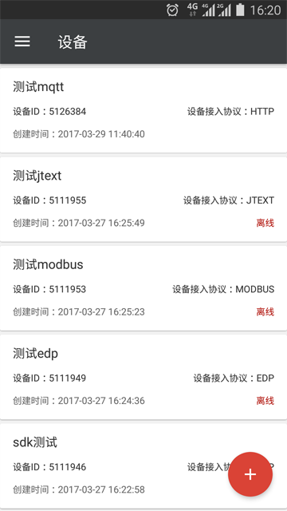
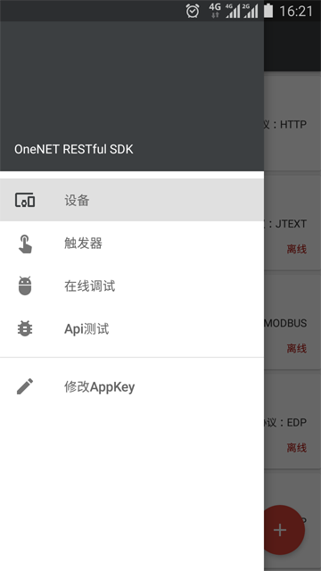
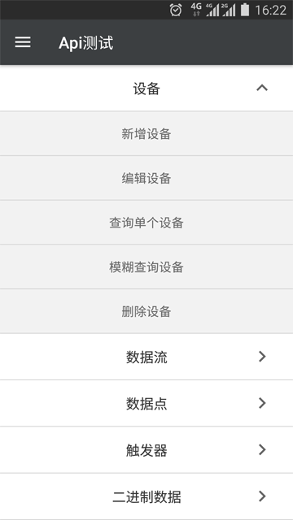
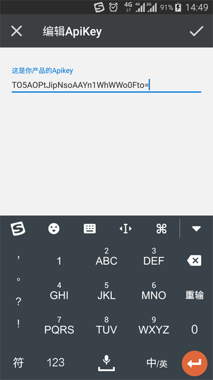
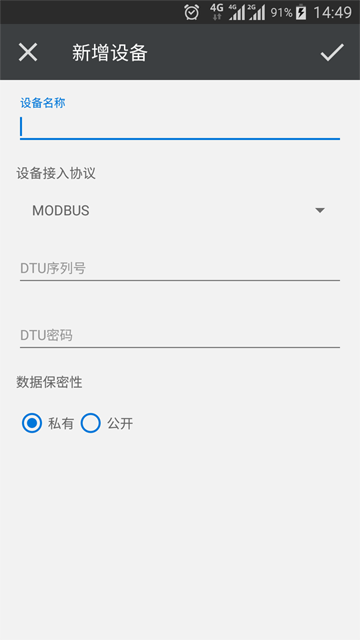
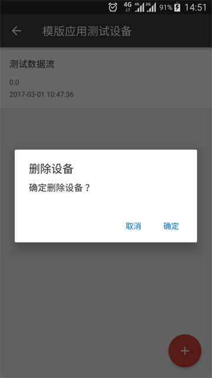
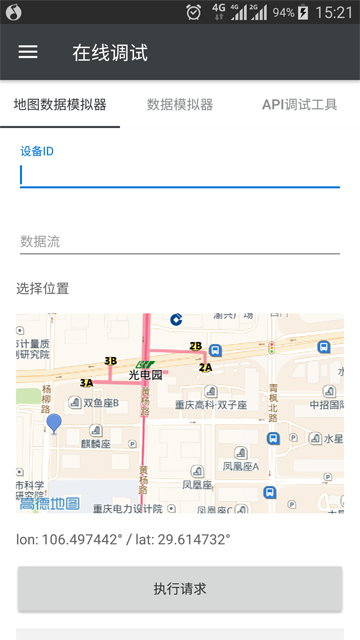
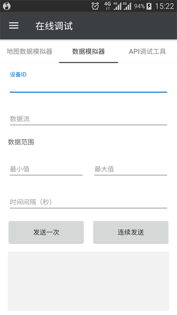
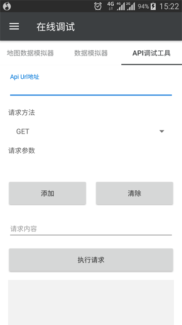
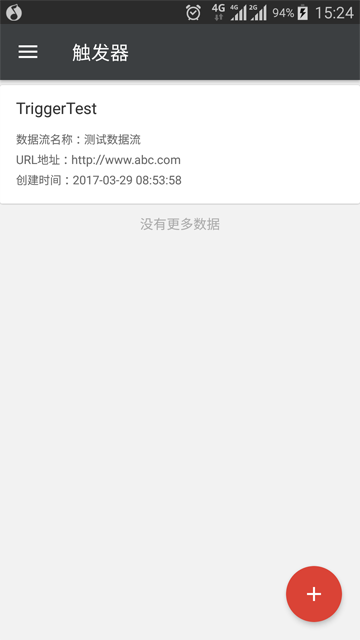

# OneNET RESTful SDK for Android

[  ](https://bintray.com/darren/maven/onenet-sdk/_latestVersion)
[]()


This project is a client SDK developed by **China Mobile Internet of Things Company** 为方便Android开发者接入 **OneNET** 平台而开发的客户端SDK。关于 **OneNET** 请进入This project is a client SDK developed by ** China Mobile Internet of Things Company ** to facilitate Android developers to access the ** OneNET ** platform. About ** OneNET ** Please enter [** OneNET Portal **] (http://open.iot.10086.cn) for details.


## System Requirements

-SDK running requirements: Android 1.6 (API 4) and above
-Sample running requirements: Android 4.1 (API 16) and above


## Instructions

```gradle
dependencies {
    implementation 'com.chinamobile.iot.onenet:onenet-sdk:2.2.1'
}
```

Detailed instructions **please refer to [wiki documentation](https://github.com/cm-heclouds/AndroidSDK/wiki)**

## Example


The v2.0 version provides more beautiful and rich sample apps for developers' reference. It follows the style of Google Material Design and is completely open source. Developers can view the details of the Clone project source code.
You can also download it here [**Download installation package**](OneNET_SDK-Sample.apk)

 
 
 
 
 

## Third-party libraries used

### SDK

- [OkHttp](https://github.com/square/okhttp)

### Sample App

- Android AppCompat v7
- Android Design Support Library
- Android CardView v7
- Android RecyclerView v7
- [Gson](https://github.com/google/gson)
- [BaseRecyclerViewAdapterHelper](https://github.com/CymChad/BaseRecyclerViewAdapterHelper)
- [FloatingActionButton](https://github.com/Clans/FloatingActionButton)

## Feedback and comments

-The v2.0 version completely rewrites the SDK. The transport layer uses  [OkHttp3](https://github.com/square/okhttp)， The API is based on [OneNET RESTful documentation](http://www.heclouds.com/doc/art262.html#68) has been added and subtracted accordingly, the API is not compatible with v1.x, please use the v1.x version developers to upgrade carefully.
-Developers who have updated to v2.x, if you want to view the code of v1.x, just `git checkout OneNETSDK-v1`,or [View hare](https://github.com/cm-heclouds/AndroidSDK/tree/OneNETSDK-v1)。

## Feedback and comments


Any problems encountered in the SDK use process can be feedbacked through Issues. Please describe the problems encountered as clearly as possible. If there is an error message attached, and the type is specified as bug or other in Labels, we will use Fastest solution.

[View the existing Issues and submit bugs here] (https://github.com/cm-heclouds/AndroidSDK/issues)

## License

The MIT License (MIT)

    Copyright (c) 2015-2018 China Mobile IOT

    Permission is hereby granted, free of charge, to any person obtaining a copy
    of this software and associated documentation files (the "Software"), to deal
    in the Software without restriction, including without limitation the rights
    to use, copy, modify, merge, publish, distribute, sublicense, and/or sell
    copies of the Software, and to permit persons to whom the Software is
    furnished to do so, subject to the following conditions:

    The above copyright notice and this permission notice shall be included in all
    copies or substantial portions of the Software.

    THE SOFTWARE IS PROVIDED "AS IS", WITHOUT WARRANTY OF ANY KIND, EXPRESS OR
    IMPLIED, INCLUDING BUT NOT LIMITED TO THE WARRANTIES OF MERCHANTABILITY,
    FITNESS FOR A PARTICULAR PURPOSE AND NONINFRINGEMENT. IN NO EVENT SHALL THE
    AUTHORS OR COPYRIGHT HOLDERS BE LIABLE FOR ANY CLAIM, DAMAGES OR OTHER
    LIABILITY, WHETHER IN AN ACTION OF CONTRACT, TORT OR OTHERWISE, ARISING FROM,
    OUT OF OR IN CONNECTION WITH THE SOFTWARE OR THE USE OR OTHER DEALINGS IN THE
    SOFTWARE.
